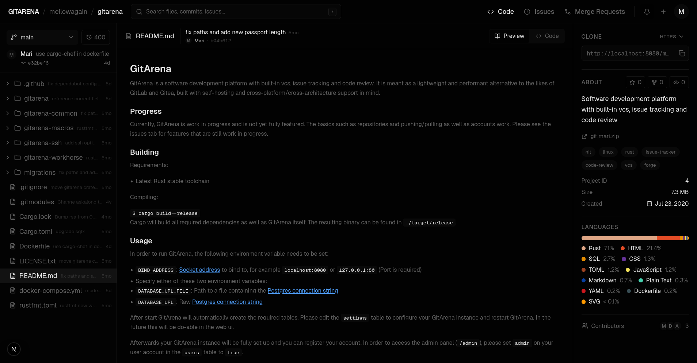
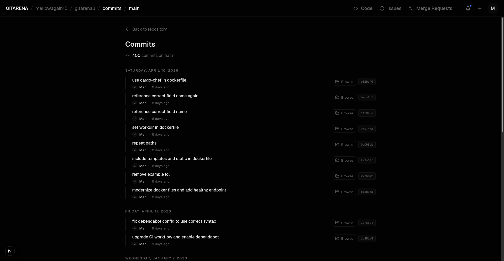
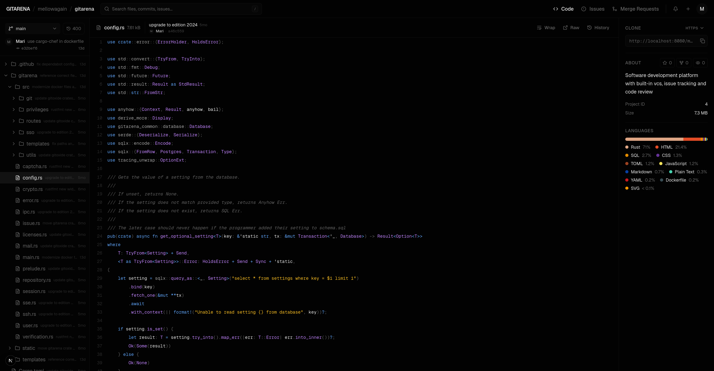
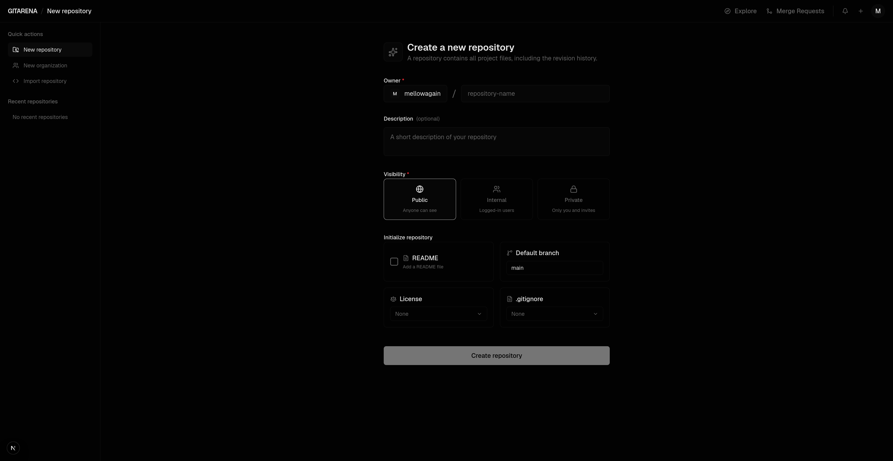
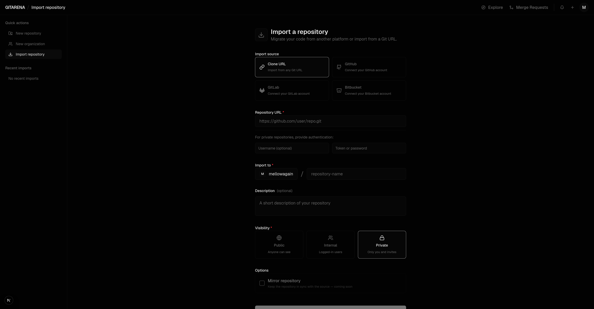
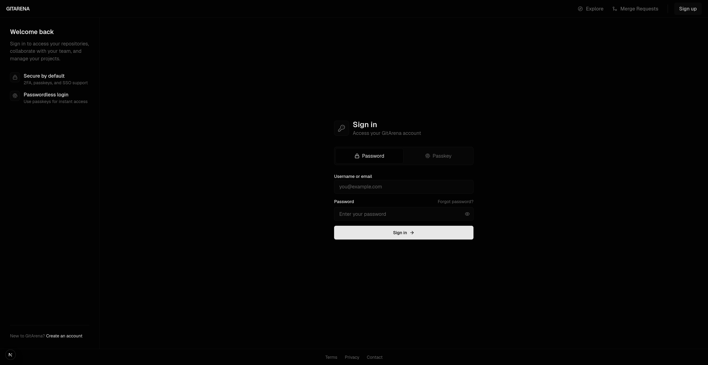
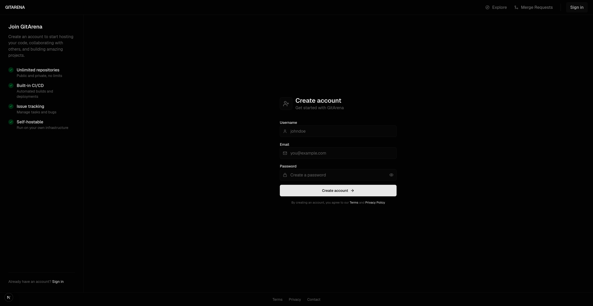
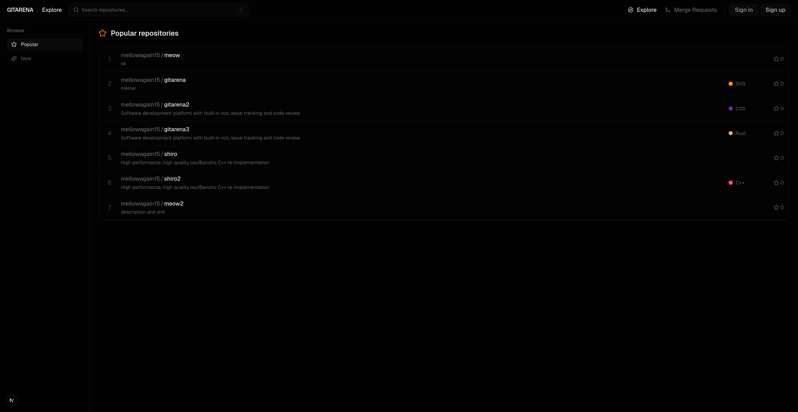

# GitArena

GitArena is a software development platform with built-in vcs, issue tracking and code review.
It is meant as a lightweight and performant alternative to the likes of 
GitLab and Gitea, built with self-hosting and cross-platform/cross-architecture
support in mind.

To see a demo, you may browse the source code of GitArena itself on my hosted GitArena instance: https://git.mari.zip/mellowagain/gitarena

<details>
<summary>Features progress</summary>

### Basics

- [x] Git protocol support
  - [x] HTTP(S)
  - [x] SSH
- [x] Repository management
  - [x] Create
  - [x] Fork
  - [ ] Rename
  - [x] Branch listing
  - [ ] Tag listing
  - [ ] Releases
    - [ ] Autogenerated changelogs from merged PRs
    - [ ] Asset upload
    - [ ] Semantic version tagging UI 
- [x] Web-based code browser
  - [x] Syntax-highlighted file view
  - [x] Blame
  - [x] View raw
  - [x] Commit history with diffs
- [x] User auth
  - [x] Username and password auth
  - [x] SSH key management
  - [x] Org/team model for access control
- [ ] Merge requests
  - [ ] Open, review, approve, merge
  - [ ] Inline comments on diffs 
  - [ ] Merge strategies (merge commit, squash, rebase)
- [ ] Issue tracker
  - [ ] open/close issues
  - [ ] Labels
  - [ ] Milestones
  - [ ] Assignees
  - [ ] Kanban
- [ ] Webhooks 
- [x] REST API
- [ ] Protected branches
  - [ ] Require reviews 
  - [ ] status checks before merge
  - [ ] Prevent direct pushes to `main`

### Nice to haves

- [ ] Woodpecker CI
- [ ] Package registry
- [ ] Wiki per repository
- [x] Code search
- [x] OAuth/SSO
- [ ] CLI
- [ ] MCP
- [ ] Email notifications
- [ ] Dependency/vulnerability scanning hooks
- [ ] Commit/PR cross-linking

### Stretch goals

- [ ] Federation via ForgeFed/AT Proto
- [ ] VS Code / JetBrains IDE integration
- [ ] Review iteration tracking: show what changed between force-pushed versions of a PR (like Gerrit's patchset model)
- [ ] Merge queue
- [ ] Commit signing + verification
- [ ] Mirror/sync: bi-directional

</details>

## Building

### Backend

Requirements:

- Latest Rust stable toolchain

Compiling:

```
$ cd gitarena
$ cargo build --release
```

### Frontend

Requirements:

- Node.js 24
- pnpm 10

Building:

```
$ cd gitarena-frontend
$ pnpm run build
```

## Running

You can either spin up everything via a Docker Compose or the backend and frontend separately.

### Docker

A `docker-compose.yml` is provided to spin up all GitArena components:

- Rust backend
- Next.js frontend
- Postgresql

```
$ docker compose up -d
```

### Backend

In order to run the GitArena backend, the following environment variable needs to be set:

- `BIND_ADDRESS`: [Socket address](https://doc.rust-lang.org/nightly/std/net/trait.ToSocketAddrs.html) to bind to, for example `localhost:8080` or `127.0.0.1:80` (Port is required)
- `DATABASE_URL`: Raw [Postgres connection string][postgres]

Optional environment variables:

- `MAX_POOL_CONNECTIONS`: Max amount of connections the Postgres connection pool should keep open and ready to use.
- `NO_STDOUT_LOG`: Set to any value to only write logs to the log file (and Otel, if configured)
- `OTEL_SERVICE_NAME`: Service name to be used for metrics, traces and logs

Observability is provided through Otel and can be optionally enabled by setting:

- `OTEL_EXPORTER_OTLP_ENDPOINT`: URL to a otlp endpoint

Standardized [Otel environment variables](https://opentelemetry.io/docs/languages/sdk-configuration/otlp-exporter/) are supported.

GitArena gets compiled as a normal binary so you can just run it. 
After start GitArena will automatically create the required tables. Please edit the `settings` table to configure your
GitArena instance and restart GitArena. In the future this will be do-able in the web ui.

Afterwards, your GitArena instance will be fully set up and you can register
your account. In order to access the admin panel (`/admin`), please set
`admin` on your user account in the `users` table to `true`.

The frontend will now be reachable at https://localhost:8080/api or your configured hostname and port.

### Frontend

In order to run the GitArena frontend, the following environment variables need to be set:

- `NODE_ENV`: set to `production`
- `NEXT_PUBLIC_API_URL`: URL to the GitArena backend, defaults to `http://localhost:8080`

Optionally you can set:

- `HOSTNAME`: address to bind to, default `0.0.0.0`
- `PORT`: port to bind to, default `3030`

Then run:

```
$ cd gitarena-frontend
$ pnpm run start
```

The frontend will now be reachable at https://localhost:3030 or your configured hostname and port.

## Screenshots

Repository:



Repository commits:



File view:



Create repository:



Import repository:



Login:



Sign up:



Explore:



## Thank you


GitArena is part of the [Mintlify OSS Program](https://www.mintlify.com/oss-program), meaning we receive gracious support from them
in the form of a free Mintlify Pro plan (normally $300/month) to host our [documentation](https://git.mari.zip/docs).

[postgres]: https://www.postgresql.org/docs/12/libpq-connect.html#id-1.7.3.8.3.6
