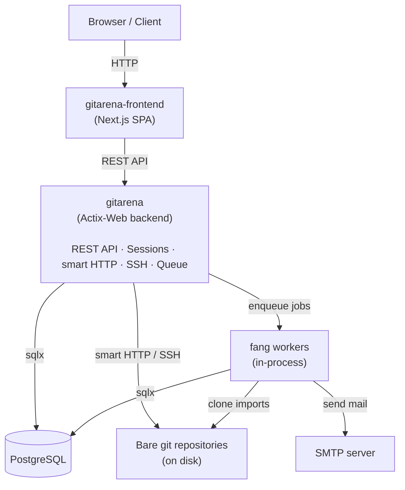

GitArena is a Rust backend, a proc-macro crate, and a separate Next.js frontend. The backend owns the REST API, smart HTTP git routes, built-in SSH server, migrations, and background job queue.

## Components

## Crates

| Crate | Directory | Role |
|-------|-----------|------|
| `gitarena` | `gitarena/` | Main Actix-Web backend binary |
| `gitarena-macros` | `gitarena-macros/` | Proc-macro crate for route and config helpers |
| `gitarena-frontend` | `gitarena-frontend/` | Next.js SPA frontend |

## Data flow

### HTTP request

<Steps>
  <Step title="Load the frontend">
    The browser loads the Next.js app.
  </Step>
  <Step title="Call the backend">
    Client components fetch JSON from the backend REST API with SWR.
  </Step>
  <Step title="Read or write state">
    Actix-Web handlers query PostgreSQL through `sqlx`, then return JSON or an error response.
  </Step>
</Steps>

### Background task (example: git import)

<Steps>
  <Step title="Queue the task">
    The backend receives `POST /api/repo/import`, creates the repository record, and enqueues an `ImportTask` in PostgreSQL through fang.
  </Step>
  <Step title="Run inside the backend process">
    An in-process worker picks up the task and clones the remote repository into the configured repository directory.
  </Step>
  <Step title="Retry failures">
    Fang tracks retries and marks failed tasks after their retry limit.
  </Step>
</Steps>

### SSH git operation

<Steps>
  <Step title="Connect to the built-in SSH server">
    Users connect as `git` and present a public key.
  </Step>
  <Step title="Authenticate against PostgreSQL">
    The backend looks up the key in `ssh_keys` and resolves the GitArena user.
  </Step>
  <Step title="Run git service commands">
    The SSH server handles `git-upload-pack` and `git-receive-pack` directly against repositories on disk.
  </Step>
</Steps>

## Database

All persistent application state lives in PostgreSQL. Migrations are embedded in the backend binary through `sqlx::migrate!` and run automatically on startup. The migration files live in `migrations/`.

Bare git repositories live on disk under the path stored in `repositories.base_dir`.
