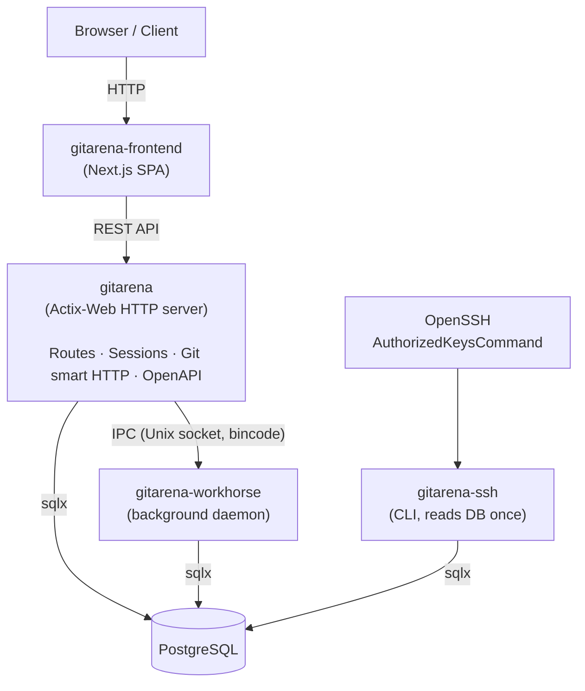

GitArena is split into several Rust crates and a Next.js frontend. Each component has a clear responsibility. They communicate through HTTP, Unix sockets, and a shared database.

## Components

## Crates

| Crate | Directory | Role |
|-------|-----------|------|
| `gitarena` | `gitarena/` | Main HTTP binary |
| `gitarena-common` | `gitarena-common/` | Shared library: DB pool, models, IPC, packet definitions |
| `gitarena-macros` | `gitarena-macros/` | Proc-macro crate: config accessors, IPC derive, route helpers |
| `gitarena-ssh` | `gitarena-ssh/` | CLI for SSH key lookup; invoked by OpenSSH |
| `gitarena-workhorse` | `gitarena-workhorse/` | Background daemon for async tasks |
| `gitarena-frontend` | `gitarena-frontend/` | Next.js SPA frontend |

## Data flow

### HTTP request

1. The browser loads the Next.js SPA.
2. The frontend fetches data from the backend's REST API.
3. Actix-Web handles the request, queries PostgreSQL via `sqlx`, and returns JSON.

### Background task (example: git import)

1. The backend receives an import request and serializes a `GitImport` packet.
2. The packet is sent over a Unix socket to the workhorse.
3. The workhorse deserializes the packet and clones the remote repository.
4. Progress and results are written back to PostgreSQL.

### SSH key lookup

1. A user pushes over SSH to the host.
2. OpenSSH calls `gitarena-ssh authorized-keys`.
3. The CLI connects to PostgreSQL, reads all public keys, and prints them in `authorized_keys` format.
4. OpenSSH uses the output to authenticate the push.

## Database

All persistent state lives in PostgreSQL. Migrations are embedded in the binary via `sqlx::migrate!` and run automatically on startup. The migration files live in `migrations/`.

## Shared library

`gitarena-common` is linked by the main server, the workhorse, and the SSH CLI. It provides:

- The database connection pool (`sqlx::PgPool`)
- Model structs for users, repositories, sessions, and more
- The IPC protocol types and the `ipc_path()` function
- Packet definitions (`GitImport`, etc.)
