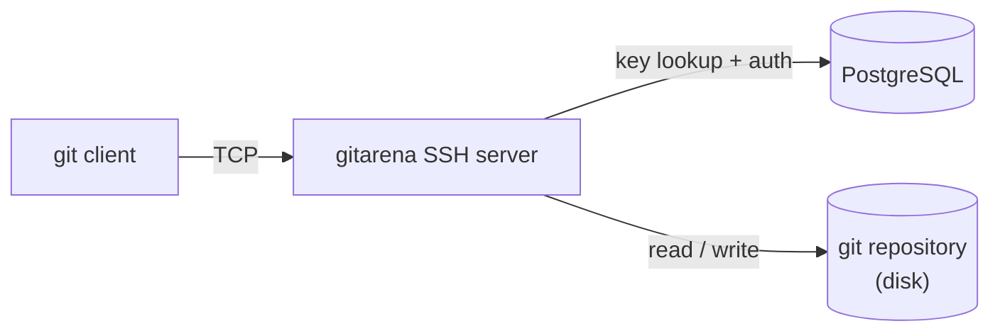

The main `gitarena` binary includes a built-in SSH server that handles git push and pull over SSH. It runs alongside the HTTP server as part of the same process.

## How it works

When a client connects, the server authenticates the user by their public key and then processes the git command (`git-upload-pack` or `git-receive-pack`) directly:



<Steps>
  <Step title="Connect and authenticate">
    The client connects and presents a public key. The server looks up the key in the `ssh_keys` table and resolves the associated user.
  </Step>
  <Step title="Exec request">
    The client sends a `git-upload-pack` or `git-receive-pack` exec request. The server checks repository access and push permissions.
  </Step>
  <Step title="Ref advertisement">
    The server sends the ref advertisement to the client.
  </Step>
  <Step title="Data exchange">
    The client streams its request (object negotiation or pack data). The server processes it and streams the response back.
  </Step>
</Steps>

## Git protocol versions

The SSH transport defaults to protocol v1. To use v2, the client must set the `GIT_PROTOCOL` environment variable explicitly before connecting:

```bash
GIT_PROTOCOL=version=2 git clone git@your-instance:username/repo.git
```

To make this permanent, add it to your shell profile or git config:

```bash
git config --global protocol.version 2
```

| Version | How to enable                | Upload-pack advertisement       |
|---------|------------------------------|---------------------------------|
| v1      | Default                      | Full ref list with capabilities |
| v2      | Set `GIT_PROTOCOL=version=2` | Capabilities only (no refs)     |

## Authentication

Only public key authentication is accepted. Password authentication is rejected. The SSH username must be `git` — this is standard practice for git hosting services:

```bash
git clone git@your-instance:username/repo.git
```

Users manage their SSH keys through account settings in the web UI. See the [API reference](/api-reference/introduction) for the key management endpoints.

## Configuration

The SSH server reads its settings from the `settings` table:

| Setting                           | Default | Description                                  |
|-----------------------------------|---------|----------------------------------------------|
| `ssh.enabled`                     | `true`  | Enable or disable the SSH server             |
| `ssh.port`                        | `2222`  | Port the server binds to                     |
| `ssh.auth_rejection_time_seconds` | `5`     | Delay before rejecting a failed auth attempt |

The server host key is generated automatically on first start and stored in the `ssh.private_key` setting. It persists across restarts and cannot be overridden from the environment.

## Shell access

If a user connects without issuing a git command (e.g. by opening an interactive SSH session), the server greets them by name and closes the connection. Shell access is not provided.
