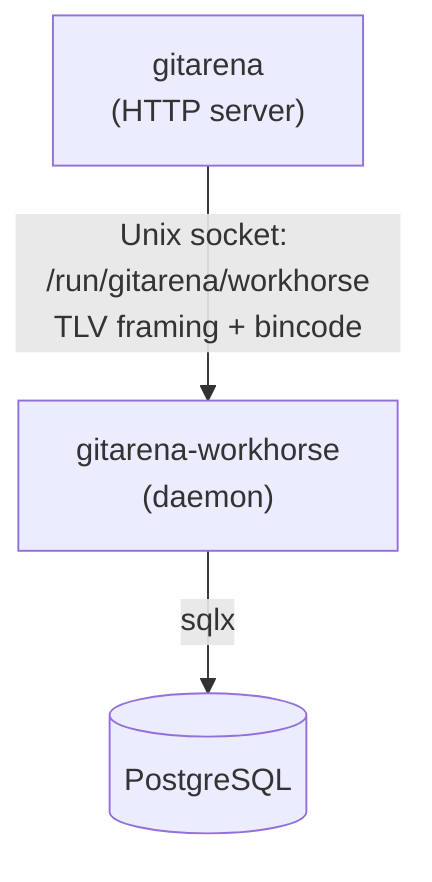

`gitarena-workhorse` is a Tokio async daemon that handles long-running background tasks — things that would be too slow or resource-intensive to do inline in an HTTP request. The main server delegates work to it over a Unix socket using a binary IPC protocol.

## How it works



1. The main server creates an `IpcPacket<T>` and serializes it with bincode.
2. It writes the serialized bytes to the Unix socket at `/run/gitarena/workhorse`.
3. The workhorse reads the packet, identifies its type, and dispatches to the right handler.
4. The handler performs the work (e.g., cloning a remote repository) and writes results to the database.

On Windows, the Unix socket is replaced with a named pipe at `\\.\pipe\gitarena-workhorse`.

## Packet format

Each packet uses a TLV (type-length-value) structure:

| Field | Size | Description |
|-------|------|-------------|
| Type | 8 bytes (u64, little-endian) | `PacketId` discriminant |
| Length | 8 bytes (u64, little-endian) | Byte length of the payload |
| Payload | variable | bincode-encoded packet struct |

The maximum payload size is 1 MB. The bincode encoding uses little-endian byte order and varint encoding for variable-length integers.

The IPC path, framing, and size limit are defined in `gitarena-common/src/ipc.rs`.

## Packet types

Packet IDs are defined in `gitarena-common/src/packets/mod.rs`. Currently one packet type exists:

| ID | Name | Category | Description |
|----|------|----------|-------------|
| 1001 | `GitImport` | Git (1000) | Import a repository from a remote URL |

The `GitImport` packet is defined in `gitarena-common/src/packets/git.rs`:

```rust
#[derive(IpcPacket)]
pub struct GitImport {
    pub url: String,
    pub username: Option<String>,
    pub password: Option<String>,
}
```

## Adding a new packet type

1. Add a new variant to `PacketId` in `gitarena-common/src/packets/mod.rs`:

```rust
pub enum PacketId {
    GitImport = 1001,
    YourNewTask = 2001,  // pick the next ID in your category
}
```

2. Create the packet struct in `gitarena-common/src/packets/`:

```rust
#[derive(IpcPacket)]
pub struct YourNewTask {
    pub some_field: String,
}
```

3. Add a handler in `gitarena-workhorse/src/main.rs`:

```rust
PacketId::YourNewTask => {
    let packet: YourNewTask = bincode::deserialize(&payload)?;
    handle_your_task(packet, &pool).await?;
}
```

4. Send the packet from the main server:

```rust
let packet = IpcPacket::new(YourNewTask { some_field: "...".into() });
packet.send(&ipc_path()).await?;
```

## Running the workhorse

The workhorse requires the socket directory to exist and be writable:

```bash
sudo mkdir -p /run/gitarena
sudo chown $USER /run/gitarena
```

Start it before the main server:

```bash
cargo run -p gitarena-workhorse
```

In production, manage it as a systemd service alongside the main server.
